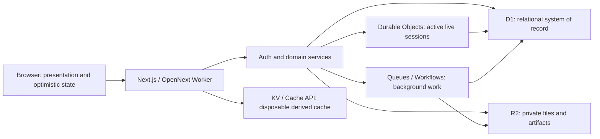

# ADR 0001: Cloudflare application platform

- **Status:** Accepted
- **Date:** 2026-08-01
- **Owners:** Encounterizer maintainers
- **Supersedes:** Browser-only/static-hosting as the long-term architecture

## Context

Encounterizer is currently exported as a static Next.js application and stores
durable user state in the browser. The target product needs authenticated
multi-device data, server-enforced campaign isolation, private files, live
sessions, and retryable background work without operating a conventional
server fleet.

Cloudflare currently documents deployment of Next.js to Workers through the
[OpenNext adapter](https://developers.cloudflare.com/workers/framework-guides/web-apps/nextjs/).
That runtime requires `nodejs_compat` and a compatibility date of at least
2024-09-23. Not every Next.js feature has identical support; in particular,
Node.js middleware is not currently supported by the adapter. CF-1 must test
the exact framework and adapter versions before production promotion.

## Decision

Encounterizer will begin as one full-stack, modular-monolith Worker. Domain
modules share one deployment but expose narrow server-only interfaces. A
service is split out only when an independently scaled, secured, or deployed
boundary is demonstrated.

### Authority boundaries

| Data or behavior | Authority | Rule |
|---|---|---|
| Accounts, sessions, campaigns, roles, invitations | D1 | Relational constraints and server authorization are canonical |
| Parties, encounters, notes, maps, catalog metadata | D1 | Writes use committed migrations and revisioned domain commands |
| Original uploads and generated binary artifacts | Private R2 | D1 metadata owns tenancy; object keys never grant access |
| Active battle/session command ordering | One SQLite-backed Durable Object per session | A command is acknowledged only after durable object storage commits |
| Archived live-session state | D1 snapshots/events | Durable Object memory is never the only copy |
| Import, export, thumbnail, cleanup, and notification jobs | Queues or Workflows | At-least-once work is idempotent and has bounded retries |
| SRD/catalog acceleration and other derived reads | KV or Cache API | Cache entries are versioned, disposable, and never authorization authority |
| Browser state | Memory plus short-lived optimistic cache | The browser reconciles to server state and is not a second source of truth |

### Runtime rules

- Server components, route handlers, and server actions call the same domain
  and authorization services. UI code does not write storage bindings directly.
- OpenNext middleware/proxy may perform redirects and cheap UX checks only.
  Protected handlers and server-rendered pages validate the database-backed
  session and resource authorization at the point of use.
- Bindings are used instead of Cloudflare REST APIs in request paths.
- Request bodies and R2 objects are streamed; large payloads are not fully
  buffered in Worker memory.
- No request-specific mutable state is stored at module scope. Every promise is
  awaited, returned, or passed to `waitUntil` for explicitly non-critical work.
- Schemas are changed only by committed, forward-tested D1 and Durable Object
  migrations. Production never runs an implicit auth/ORM migration at startup.
- Secrets live in Worker secrets or Secrets Store and are never placed in
  `vars`, client bundles, repository files, or logs.

## Alternatives considered

- **Keep Azure Static Web Apps and browser authority:** rejected because it
  cannot provide the required server authority, private multi-device data, or
  live-session coordination.
- **Cloudflare Pages as the primary runtime:** rejected for the target design;
  Workers plus static assets is the documented full-stack path and keeps all
  bindings in one runtime.
- **KV as the primary database:** rejected because its eventual-consistency
  model is not appropriate for ownership, membership, or acknowledged writes.
- **A Durable Object for every campaign resource:** rejected because D1 is the
  better relational system of record. Durable Objects are reserved for active
  coordination that needs single-object ordering.
- **Multiple microservices immediately:** rejected because the boundaries do
  not yet justify their delivery and operational overhead.

## Consequences

The application can move one vertical at a time while keeping one authority
model. The tradeoff is a deliberate platform dependency and the need to test
OpenNext compatibility during upgrades. CF-1 owns runtime conversion; this ADR
does not prematurely add production bindings to the current static app.

## Implementation gates

- CF-1: OpenNext build, isolated bindings, typed environments, observability,
  preview deployment, and rollback.
- CF-2: database-backed authentication and centralized authorization.
- CF-4/5: server-authoritative compute, catalog, workspace, and assets.
- CF-6: SQLite-backed Durable Objects and WebSocket hibernation.
- CF-7: retryable queue/workflow jobs.
- CF-8: restore drills, load validation, and removal of browser authority.
